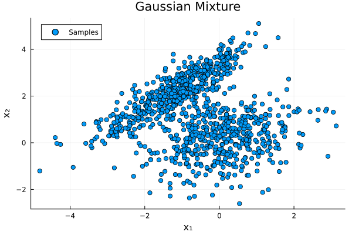
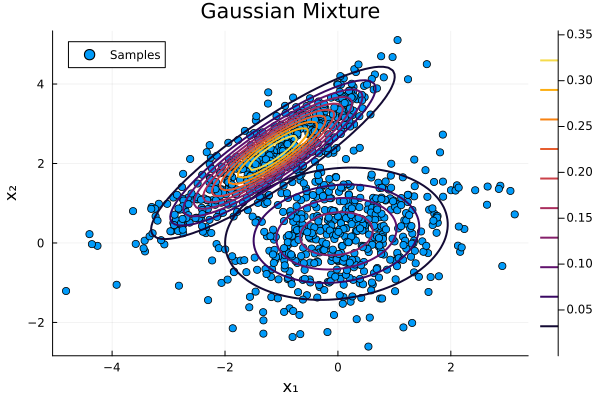

# Getting Started


## Installation

To install
[SSM Julia](https://github.com/rsenne/ssm_julia), start up
Julia and type the following code-snipped into the REPL. It makes
use of the native Julia package manger.

```julia
Pkg.add("<Package name TBD!>")
```

Additionally, for example if you encounter any sudden issues, or
in the case you would like to contribute to the package, you can
manually choose to be on the latest (untagged) version.

```julia
Pkg.develop("<Package name TBD!>")
```

## Example


Given some normal distributed clusters of data:

```julia
data = CSV.read("data.csv", DataFrame)
```




We then fit a model:
```julia
k = 2
data_dim = 2
gmmModel = SSM.GaussianMixtureModel(k, data_dim)

SSM.fit!(gmmModel, data)
```

Overlaying the trained model reveals a good fit:




## Getting Help

To get help on specific functionality you can either look up the
information here, or if you prefer you can make use of Julia's
native doc-system. The following example shows how to get
additional information on [`GaussianMixtureModel`](@ref) within Julia's REPL:

```julia
?GaussianMixtureModel
```

If you encounter a bug or would like to participate in the
development of this package come find us on Github.

- [rsenne/ssm_julia](https://github.com/rsenne/ssm_julia)